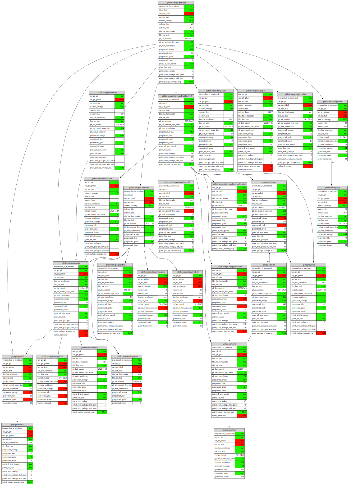

# Collect data about your dependencies

Data sources:

- [x] Analyzes git log
- [x] Runs tests and code coverage
- [ ] Runs linters
- [ ] Detects benchmarks
- [x] goreportcard.com
- [x] codecov.io
- [ ] codacy.com
- [ ] Readme for words and badges
- [ ] Version of module is stable
- [ ] Version of Go in go.mod
- [ ] Mentionings in Awesome-lists
- [ ] GitHub: Repo, Organization, Contributors, Stars, Contributor, Contributors organizations, Is contributor active?

Render with [dot](https://graphviz.org):

```
$ go mod graph | ./bin/import-graph -output=dot | dot -Tsvg > output.svg
```


Output in [JSONL](https://jsonlines.org) graph:
```
$ go mod graph | ./bin/import-graph
```
```
{"id":"golang.org/x/net","can_get_gitstats":true,"can_get_codecov":false,"can_run_tests":true,"git_url":"https://go.googlesource.com/net","git_last_commit":"2021-04-20","git_last_commit_days_since":1,"git_num_contributors":196,"has_tests":true,"has_test_files":true,"num_packages":33,"num_packages_with_tests":30,"num_packages_with_tests_files":30,"num_packages_tests_passed":30,"package_coverage_avg":25.9,"package_coverage_min":71.35666666666665}
{"id":"golang.org/x/tools","can_get_gitstats":true,"can_get_codecov":false,"can_run_tests":false,"git_url":"https://go.googlesource.com/tools","git_last_commit":"2021-04-20","git_last_commit_days_since":1,"git_num_contributors":389}
{"from":"github.com/gin-gonic/gin","to":"github.com/gin-contrib/sse"}
{"from":"github.com/gin-gonic/gin","to":"github.com/go-playground/validator/v10"}
...
```

Pretty-print with [jq](https://github.com/stedolan/jq):
```
$ go mod graph | ./bin/import-graph | jq -f
```
```
...
{
    "id": "github.com/gin-gonic/gin",
    "can_get_gitstats": true,
    "can_get_codecov": true,
    "can_run_tests": true,
    "github_url": "https://github.com/gin-gonic/gin",
    "git_url": "https://github.com/gin-gonic/gin",
    "git_last_commit": "2021-04-21",
    "git_last_commit_days_since": 1,
    "git_num_contributors": 321,
    "codecov_url": "https://app.codecov.io/gh/gin-gonic/gin",
    "codecov_files": 41,
    "codecov_lines": 2036,
    "codecov_coverage": 98.67,
    "has_tests": true,
    "has_test_files": true,
    "num_packages": 6,
    "num_packages_with_tests": 4,
    "num_packages_with_tests_files": 4,
    "num_packages_tests_passed": 4,
    "package_coverage_avg": 96.3,
    "package_coverage_min": 98.9
}
...
```

## Related Projects

- `Graphviz` https://graphviz.org/ is a very popular tool for visualizing graph data, most of tools bellow use dot from it
- `Graphviz` https://graphviz.org/Gallery/directed/neural-network.html is nice example of dot format
- `Graphviz` http://magjac.com/graphviz-visual-editor online editor
- `Docs` https://awesomeopensource.com/projects/dependency-graph is a list of dependency visualization projects  
- `Go` https://github.com/loov/goda written in Go; analyses imports on its own; does not collect dta; CLI; dot  
- `Go` https://github.com/adonovan/spaghetti wirtten in Go; search and read details about selected package; web; not graphic
- `Go` https://github.com/psampaz/go-mod-outdated written in Go; pretty prints built-in Go tooling; not collecting; not dot; CLI 
- `Go` https://github.com/firstrow/go-outdated written in Go; deprecated; collects data from GitHub; CLI
- `GitHub Tasks` https://github.com/moul/depviz written in Go and JavaScript; collects data from GitHub Tasks; plots nice web UI
- `C++` https://github.com/jmarkowski/codeviz written in Python; C++ headers analysis; does not collect data; CLI; dot  
- `Python` https://github.com/thebjorn/pydeps written in Python; looks for Python bytecode imports; clustering; does not collect data; CLI; dot  
- `Python` https://github.com/naiquevin/pipdeptree written in Python; looks for python modules locally; does not collect data; CLI; JSON and dot, Deprecated  
- `JavaScript` https://github.com/auchenberg/dependo written in JavaScript; does not fetch data; D3.js; CLI; HTML   
- `JavaScript` https://github.com/pahen/madge written in JavaScript; does not collect data; CLI; dot  
- `JavaScript` https://github.com/sverweij/dependency-cruiser written in JavaScript; rules; does not collect data; CLI; dot  
- `JavaScript` https://github.com/anvaka/npmgraph.an written in JavaScript; collects data; HTML; hosted in GitHub Pages  
- `JavaScript` https://github.com/anvaka/npmgraphbuilder written in JavaScript; collects data; module  
- `JavaScript` https://github.com/dyatko/arkit written in JavaScript; modules and dependencies; CLI; svg, puml  
- `JavaScript` https://github.com/hughsk/colony written in JavaScript; does not collect data; HTML; JSON  
- `JavaScript` https://www.npmjs.com/package/node-dependency-visualizer written in JavaScript; does not collectdata; CLI; dot  
- `Objective-C` `Swift` https://github.com/PaulTaykalo/objc-dependency-visualizer written in JavaScript and Ruby; does not collect data; CLI; dot; HTML; D3.js   
- `Java` https://github.com/arunkumar9t2/scabbard written in Kotlin; CLI; dot  
- `PHP` https://github.com/mamuz/PhpDependencyAnalysis written in PHP; does not collect data; code analysis; CLI; dot  
- `Go` `Python` `Java` `JavaScript` `C++` https://github.com/oss-review-toolkit/ort written in Kotlin JavaSCript Python; collects data; analyses; analysis, downloading, reporting; used for licence scanning in open source; good architecture; a bit lacking support for Go; components may not be used separately  
- `Code` https://github.com/aspiers/git-deps written in Python; analyses dependencies of commits in Git repository  
